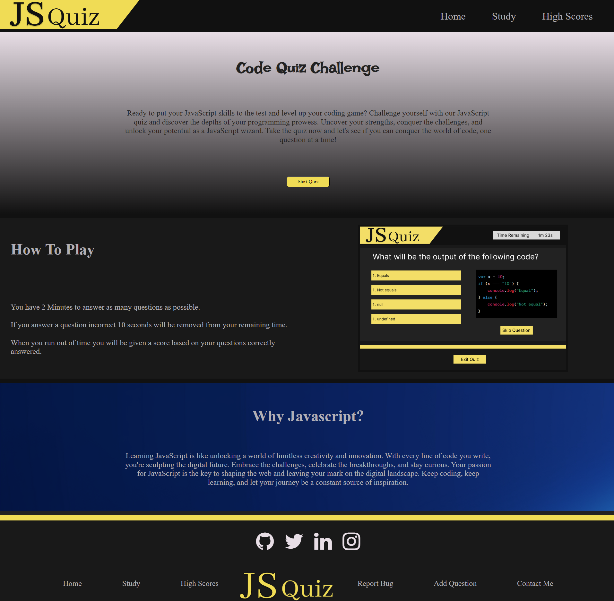
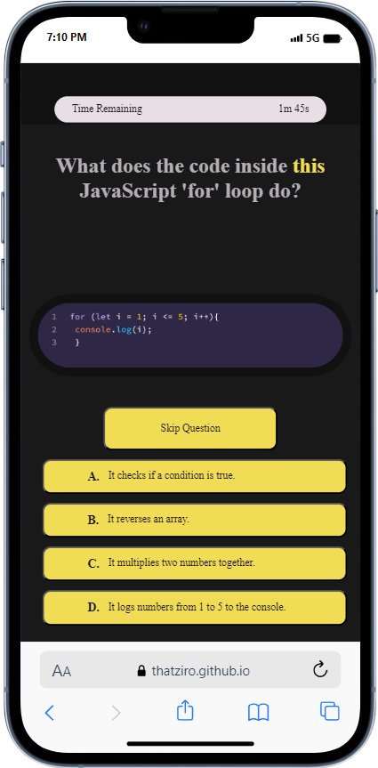
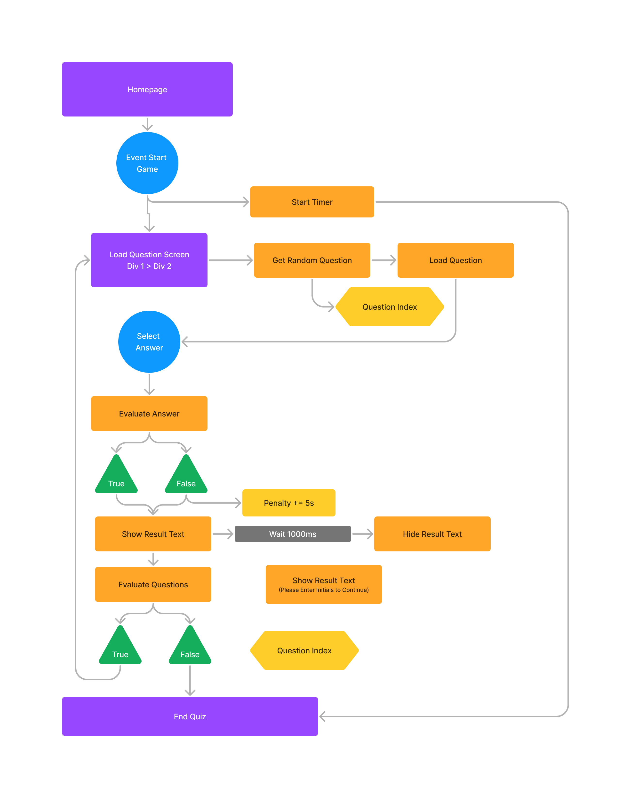
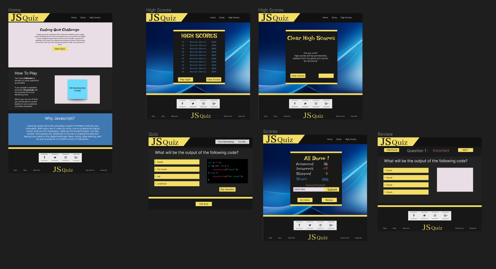

[![Contributors][contributors-shield]][contributors-url]
[![Forks][forks-shield]][forks-url]
[![Stargazers][stars-shield]][stars-url]
[![Issues][issues-shield]][issues-url]
[![MIT License][license-shield]][license-url]
[![LinkedIn][linkedin-shield]][linkedin-url]

<!-- PROJECT LOGO -->
 

  

<h3 align="center">Brandon Barnes</h3>

  
Step into the world of JavaScript mastery with our interactive JavaScript Quiz! Whether you're a coding enthusiast or a seasoned developer, this quiz is designed to put your JavaScript knowledge to the test. Challenge yourself with a variety of thought-provoking questions and sharpen your coding skills as you go. Our user-friendly interface ensures a seamless experience, and you'll receive instant feedback on your answers. Take the plunge into the JavaScript universe and see how well you really know this versatile language. Are you up for the challenge?
  

  
 – Test your JavaScript knowledge today!

 
 

<h3 font size="1" align="right"><a href="https://thatziro.github.io/Javascript-Quiz/" target="_blank">Visit Site🚀</a></h3>

## Table of Contents

<!-- TABLE OF CONTENTS -->

  
Table of Contents

  <ol>
    <li><a href="#tech-stack">Tech Stack</a></li>
    <li><a href="#sneak-peek">Sneak Peek</a></li>
    <li><a href="#development">Development</a></li>
    <li><a href="#contact">Contact</a></li>
  </ol>

## Tech Stack

(<a href="#readme-top">back to top</a>)

<!-- GETTING STARTED -->

## Sneak Peek

### <a href="https://thatziro.github.io/Javascript-Quiz/" target="_blank">Visit Site</a> 🚀

(<a href="#readme-top">back to top</a>)

## Development

  
Responsive Layouts

  

  
Flow Chart

  

  
Layout Design

  

(<a href="#readme-top">back to top</a>)

## Contact

<h4>Twitter - <a href="https://twitter.com/ThatZiro">@ThatZiro</a></h4>
<h4>Email - <a href="mailto:ImBrandonBarnes@gmail.com">ImBrandonBarnes@gmail.com</a></h4>
<h4>Github - <a href="https://github.com/ThatZiro">ThatZiro</a></h4>
<h4>Linkedin - <a href="https://www.linkedin.com/in/brandon-barnes-4b2098232/">Brandon Barnes</a></h4>

(<a href="#readme-top">back to top</a>)

<!-- MARKDOWN LINKS & IMAGES -->
<!-- https://www.markdownguide.org/basic-syntax/#reference-style-links -->

[contributors-shield]: https://img.shields.io/github/contributors/ThatZiro/Portfolio.svg?style=for-the-badge
[contributors-url]: https://github.com/ThatZiro/Portfolio/graphs/contributors
[forks-shield]: https://img.shields.io/github/forks/ThatZiro/Portfolio.svg?style=for-the-badge
[forks-url]: https://github.com/ThatZiro/Portfolio/network/members
[stars-shield]: https://img.shields.io/github/stars/ThatZiro/Portfolio.svg?style=for-the-badge
[stars-url]: https://github.com/ThatZiro/Portfolio/stargazers
[issues-shield]: https://img.shields.io/github/issues/ThatZiro/Portfolio.svg?style=for-the-badge
[issues-url]: https://github.com/ThatZiro/Portfolio/issues
[license-shield]: https://img.shields.io/github/license/ThatZiro/Portfolio.svg?style=for-the-badge
[license-url]: https://github.com/ThatZiro/Portfolio/blob/master/LICENSE.txt
[linkedin-shield]: https://img.shields.io/badge/-LinkedIn-black.svg?style=for-the-badge&logo=linkedin&colorB=555
[linkedin-url]: https://linkedin.com/in/linkedin_username
